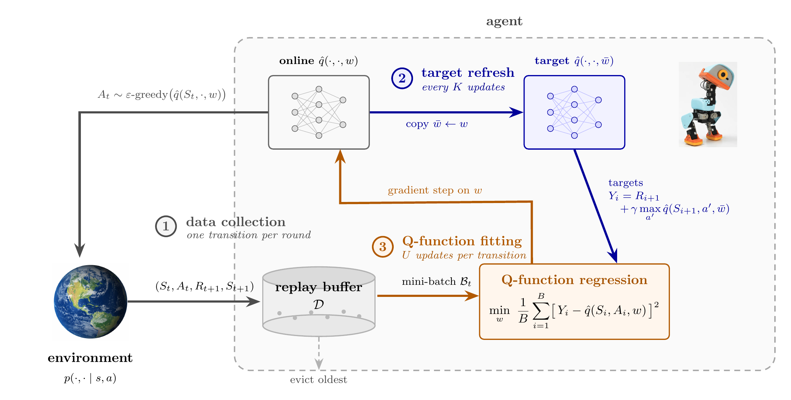

# Deep Reinforcement Learning

[](https://www.python.org/)
[](https://pytorch.org/)
[](https://gymnasium.farama.org/)
[](#roadmap)
[](LICENSE)

This project builds a PyTorch reinforcement learning library from the
mathematics outward. Algorithms are developed as a complete path from the
objective and estimator to the data flow and parameter update.

The implemented on-policy stack runs from one-step actor-critic through PPO.
DQN and Double DQN are the current implementation focus. The longer direction
includes continuous and offline RL, imitation and model-based learning,
Gymnasium and MuJoCo benchmarks, and robotics policy deployment.

> **Active development:** Public APIs may change while shared training
> components and benchmark interfaces are stabilized.

## Algorithms

### On-Policy Optimization (Implemented)

- [One-step actor-critic](src/deeprl/algorithms/one_step_actor_critic.py) ([Actor-Critic](mathematical_derivations/15_Actor-Critic.pdf), [baseline](mathematical_derivations/16_Actor-Critic-with-a-Baseline.pdf))
- [A2C](src/deeprl/algorithms/a2c.py) ([GAE Actor-Critic](mathematical_derivations/17_GAE_Actor-Critic.pdf))
- [Natural Policy Gradient](src/deeprl/algorithms/npg.py) ([derivation](mathematical_derivations/18_Natural-Policy-Gradient.pdf))
- [TRPO](src/deeprl/algorithms/trpo.py) ([derivation](mathematical_derivations/19_Trust-Region-Policy-Optimization.pdf))
- [PPO-Clip](src/deeprl/algorithms/ppo.py) (derivation in progress)

### Off-Policy Learning (In Development)

- **DQN:** [derivation](mathematical_derivations/21_Deep-Q-Network.pdf); implementation in progress
- **Double DQN:** derivation and implementation in progress
- **DDPG:** [Deterministic Policy Gradient](mathematical_derivations/23_Deterministic-Policy-Gradient.pdf) and [DDPG](mathematical_derivations/24_Deep-Deterministic-Policy-Gradient.pdf) derivations complete

## From Derivations to Systems

The derivations are working specifications for the code. They determine what
the buffers preserve, where gradients stop, which quantities remain fixed
during an update, and how training is divided into reusable components. This is
visible in boundary-correct GAE, old-policy handling in PPO, matrix-free Fisher
products, and TRPO's parameter rollback.

DQN is the current off-policy implementation target. Its derivation separates
generalized Q-learning into independently scheduled data collection,
target-network refresh, and Q-function fitting. That decomposition defines the
off-policy system now being built.

[](mathematical_derivations/21_Deep-Q-Network.pdf)

[Browse all mathematical derivations](mathematical_derivations/)

## Development Setup

Python 3.12 or later is required. Dependencies are managed with
[uv](https://docs.astral.sh/uv/).

```bash
git clone https://github.com/SaiSampathKedari/Deep-Reinforcement-Learning.git
cd Deep-Reinforcement-Learning
uv sync
```

## Roadmap

**Now:** DQN, Double DQN, and the shared replay and Q-learning system.

**Next:** Reusable policy, value, and Q-function interfaces; configurable
optimizers; DDPG, TD3, SAC; and multi-seed Gymnasium and MuJoCo benchmarks.

**Later:** Offline RL, imitation learning, model-based RL, richer policy
architectures, real-robot deployment, and VLA post-training.

## Related Repositories

- **Mathematical foundations:** [Real Analysis](https://github.com/SaiSampathKedari/Real-Analysis) | [Probability and Distribution Theory](https://github.com/SaiSampathKedari/Probability-and-Distribution-Theory) | [Statistical Inference Theory](https://github.com/SaiSampathKedari/Statistical-Inference-Theory)
- **Sequential-decision theory:** [Sequential Decision Making](https://github.com/SaiSampathKedari/Sequential-Decision-Making)
- **Classical reinforcement learning:** [Reinforcement Learning](https://github.com/SaiSampathKedari/Reinforcement-Learning)

## Contact

- Email: [sampath@umich.edu](mailto:sampath@umich.edu)
- LinkedIn: [Sai Sampath Kedari](https://www.linkedin.com/in/sai-sampath-kedari)

## License

Released under the [MIT License](LICENSE).
